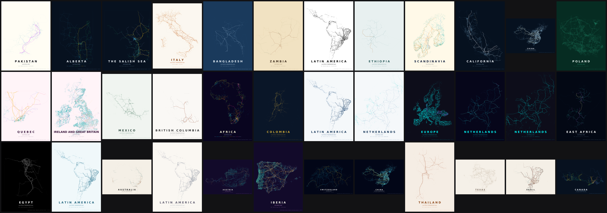

<h1 align="center">UK Power Map</h1>

<p align="center">
  Interactive Leaflet map of Great Britain transmission, generation, substations, wind turbines, and NESO zone boundaries — built on OpenStreetMap exports from this repo.
  Legacy print-ready posters are still available under <a href="poster/README.md">poster/</a>.
</p>

## UK interactive map (primary)

```powershell
python scripts/export_region.py --region uk --all
python scripts/fetch_neso_zones.py
python scripts/sync_uk_plants.py
python scripts/propose_plant_bmu_map.py --fetch
python scripts/prepare_map_data.py --region uk --skip-plants
python -m http.server 8000
```

Open [http://localhost:8000/map/](http://localhost:8000/map/) (or `?region=fr` after exporting another country). Regions and layers are defined in [`data/catalog.json`](data/catalog.json). See [`map/README.md`](map/README.md) and [`map/DEPLOY.md`](map/DEPLOY.md).

UK plant popups show BMU ids from a separate mapping table ([procedure below](#uk-plant-bmu-mapping)); OSM plant geometry lives in `data/map/uk/uk_plants_web.geojson`.

## Legacy posters

<p align="center">
  Generate print-ready posters of electrical grid infrastructure from OpenStreetMap data.
  Browse the rendered posters in the <a href="https://open-energy-transition.github.io/grid2poster/">online gallery</a>.
  Transmission lines for a country or continent are downloaded and rendered with GeoPandas, OSMnx, and Matplotlib. Grid2Poster is heavily inspired by <a href="https://github.com/originalankur/maptoposter">maptoposter</a> and reuses some of its styling.
</p>

<p align="center">
  
  
</p>

<p align="center"> Grid2Poster supports countries, states, provinces and continents, as well as predefined regions. Browse more stunnding poster in the <a href="https://open-energy-transition.github.io/grid2poster/">grid2poster gallery</a>.

## Data

Grid2Poster combines region boundaries with OpenStreetMap (OSM) power infrastructure. Coverage and tag quality vary by country; see [Data sources](#data-sources) for where each layer comes from, what it contains, and how exports are produced.

### Contributing to the data

Coverage and quality in your country can be improved by mapping transmission infrastructure directly in OpenStreetMap. [MapYourGrid](https://mapyourgrid.org) is a community initiative that coordinates this work. It provides tutorials, country-level completeness/quality statistics and mapping tools for tracing power lines, generators and substations from imagery. With [Open Infrastructure Map](https://openinframap.org/) you can browse all the electrical grid data in OpenStreetMap.

### Get inspired by the Gallery

Preprinted posters in various styles and A3 are available for most regions of the world in our <a href="https://open-energy-transition.github.io/grid2poster/">grid2poster gallery</a>:

[](https://open-energy-transition.github.io/grid2poster/)

## Installation

The project lives in two branches: the main branch and the gh-pages branch. To create your own posters, clone the main branch with the --single-branch flag, as the gh-pages branch contains all the gallery plots and is therefore massive.
```bash
git clone --single-branch https://github.com/open-energy-transition/grid2poster 
python -m venv .venv
source .venv/bin/activate
pip install -r requirements.txt
```

## Usage

To create a poster for a country, state or province, use the --country option to resolve the boundaries via [Nominatim](https://nominatim.org/). Setting a large '--tile-size-km' in kilometres and '--tile-delay' in seconds reduces the timeout of the Overpass server. By default, every run creates both a PNG and an SVG file.

By default posters print at **A3 portrait (297 × 420 mm) at 300 DPI**. Use `--paper-size` for another named preset, `--width`/`--height` for custom millimeter dimensions, and `--landscape` to flip orientation.
```bash
python create_grid_poster.py --country Brazil --tile-delay 30 --tile-size-km 500
```
Depending on the size of the country and whether distribution grids are excluded, loading the data via a single query (--single-query) is much faster. For large countries with lots of distribution grids, the data should be loaded in multiple tiles:
```bash
python create_grid_poster.py --country Pakistan --single-query
```

Include distribution grids if available. Grid coverage varies significantly across the globe and is mainly only available in Europe and North America.
```bash
python create_grid_poster.py --country Germany --include-minor-lines
```

List available themes. Create a new theme JSON file in `poster/themes/` to find your own style.
```bash
python create_grid_poster.py --list-themes
```

Once a region's data has been loaded, re-rendering it with another theme is much faster: the boundaries and OSM power features are served from the cache instead of being downloaded again. This makes it cheap to experiment with different styles for the same country.
```bash
python create_grid_poster.py --country Brazil --theme neon_cyberpunk
python create_grid_poster.py --country Brazil --theme paper_grid     # reuses the cached data
```

A theme JSON defines colors per voltage tier (`line_unknown`, `line_low`, `line_mid`, `line_high`, `line_extra`). It may optionally also set the line thickness (in points) per tier with `lw_unknown`, `lw_low`, `lw_mid`, `lw_high`, `lw_extra`, and `lw_minor`. Any width key you omit falls back to the built-in default for that tier.

Cables (`--include-cables`, underground/submarine) inherit their voltage-tier color and a dampened width by default. A theme may override this with `cable_color` (a hex color used for all cables instead of the tier color) and `cable_lw_scale` (the multiplier applied to the tier line width; defaults to `0.5`). Omit them to keep the current behavior.

Power plants (`--show-plants`) are drawn as markers sized by installed capacity (`plant:output:electricity`, square-root area scaling) and colored by generation source (`plant:source`), bucketed into solar, wind, hydro, nuclear, coal, gas, oil, biomass and other. Marker colors are derived automatically from each theme's palette so they fit the poster style; a theme may pin any bucket explicitly with `plant_solar`, `plant_wind`, `plant_hydro`, `plant_nuclear`, `plant_coal`, `plant_gas`, `plant_oil`, `plant_biomass`, `plant_other`, and override the marker outline with `plant_edge`. A second metadata row lists the installed GW per source. Use `--min-plant-capacity` to hide small plants and `--plant-marker-scale` to tune marker sizes.
```bash
python create_grid_poster.py --country Austria --show-plants --min-plant-capacity 10
```

Export transmission lines, plants, substations, and individual wind turbines as WGS84 GeoJSON for use in web maps or other GIS tools, and as CSV for database loading. Exports preserve all downloaded OSM tag columns for each feature, with complex tag values serialized as strings; CSV files include representative `latitude` and `longitude` columns plus the full geometry in `geometry_wkt`. Wind turbine exports also add parsed `capacity_mw`, `height_m`, and `rotor_diameter_m` columns when the underlying OSM tags are present. The example below renders PNG and PDF posters while exporting the UK grid, plants, substations, and turbines:
```bash
python create_grid_poster.py --country "United Kingdom" \
  --include-minor-lines --include-cables --cable-sea-buffer-km 600 \
  --format png pdf \
  --export-geojson ./data/raw/uk/powerlines.geojson \
  --export-csv ./data/raw/uk/powerlines.csv \
  --export-plants-geojson ./data/raw/uk/plants.geojson \
  --export-plants-csv ./data/raw/uk/plants.csv \
  --export-substations-geojson ./data/raw/uk/substations.geojson \
  --export-substations-csv ./data/raw/uk/substations.csv \
  --export-turbines-geojson ./data/raw/uk/wind_turbines.geojson \
  --export-turbines-csv ./data/raw/uk/wind_turbines.csv
```

For map-only ingest without rendering a poster, use `python scripts/export_uk.py --all` instead.

CSV coordinate columns are ordered as `latitude`, then `longitude`. For line and polygon features these values are representative points for the feature; the complete geometry remains available in `geometry_wkt`. GeoJSON and WKT geometries use the standard coordinate order internally (`longitude`, then `latitude`).

Use a local GeoJSON file as the boundary instead of geocoding (handy for custom regions or sub-national areas). All polygonal features in the file are dissolved into a single boundary. The `--country` value is still used for the poster title and output filename. `--landscape` will render in landscape (horizontal) orientation.
```bash
python create_grid_poster.py --country "Middle East and North Africa" --boundary-geojson ./regions/mena.geojson --landscape --theme neon_cyberpunk 
```


Render an entire continent. Continent boundaries come from the Natural Earth admin-0 dataset (downloaded and cached on first use) because Nominatim does not resolve continent names. Accepted values are `Africa`, `Antarctica`, `Asia`, `Europe`, `North America`, `Oceania`, and `South America`. The aggregate name `Global` combines every inhabited continent.

```bash
python create_grid_poster.py --country Africa --tile-size-km 500
```

Continent-scale runs hit the Overpass API hundreds of times and can take several hours. A larger `--tile-size-km` cuts the number of queries; pick a value that still stays under the Overpass per-query size limit.

### Global posters and atlas themes

`--country Global` renders the whole inhabited world as the union of the continents, clipped to a tight bounding box so it fills the page. It is the longest job in the tool (many hundreds of Overpass queries, several hours), so use a large `--tile-size-km`, a generous `--tile-delay`, and high `--voltage-tiers` so HV/EHV lines stand out at world scale. The `poster/themes/` directory ships three palettes tuned for this scale: `global_grid_atlas` (dark atlas), `global_grid_atlas_neon` (neon), and `global_paper_grid_atlas` (warm paper).

```bash
python create_grid_poster.py --country Global \
  --display-country "The Global Electrical Transmission Grid" --subtitle "Electrify Everything" \
  --theme global_grid_atlas_neon --landscape --paper-size a0 \
  --tile-size-km 1000 --tile-delay 30 --voltage-tiers 110,220,400,765 --padding -0.1
```

<p align="center">
  
</p>

If the default Overpass endpoint (`overpass-api.de`) is rate-limiting or refusing connections, switch to a mirror with `--overpass-endpoint`:
```bash
python create_grid_poster.py --country Germany --overpass-endpoint https://overpass.kumi.systems/api/interpreter
```
Other public mirrors include `https://overpass.private.coffee/api/interpreter`.

### A complex example

Most options can be combined in a single run. The command below renders the continental European grid in the `monochrome_density` theme, pulling in distribution (`--include-minor-lines`) and underground/submarine (`--include-cables`) infrastructure, and tuning the framing and download behaviour:

```bash
python3 create_grid_poster.py --country "Europe" --boundary-geojson ./regions/europe.geojson \
  --tile-size-km 800 --include-cables --include-minor-lines --theme monochrome_density \
  --tile-delay 30 --landscape --shift-y 0.18 --padding -0.35 --no-cache --cable-sea-buffer-km 500
```

What each flag contributes:

- `--boundary-geojson ./regions/europe.geojson` - use the predefined 37-unit Europe boundary instead of geocoding.
- `--tile-size-km 800` with `--tile-delay 30` - fewer, larger Overpass tiles spaced 30 s apart to stay under per-query limits without tripping rate limits.
- `--include-minor-lines` / `--include-cables` - add `power=minor_line` and `power=cable` features on top of the transmission lines.
- `--cable-sea-buffer-km 500` - inflate the boundary 500 km over water so long submarine cables survive coastline clipping.
- `--theme monochrome_density` / `--landscape` - black-on-cream density styling in horizontal orientation.
- `--shift-y 0.18` and `--padding -0.35` - push the grid up by 18 % and crop tightly into the bounds for a full-bleed composition.
- `--no-cache` - ignore any cached data on this run and fetch fresh (results are still written back to the cache).

<p align="center">
  
</p>


## Base Code Updates

This fork includes additional export-focused functionality on top of the original poster workflow:

- `power=substation` support has been added via a tiled OpenStreetMap fetcher, so substations can be exported alongside lines and plants.
- Power plant export is available separately from poster rendering with `--export-plants-geojson` and `--export-plants-csv`.
- Transmission lines, power plants, substations, and individual wind turbines can all be exported as GeoJSON and CSV in the same run.
- Wind turbine export queries OSM `power=generator` features tagged as wind via `generator:source=wind` or `generator:method=wind_turbine`, preserving all downloaded OSM tag columns.
- GeoJSON exports are written in WGS84 (`EPSG:4326`) and preserve all downloaded OSM tag columns where available.
- CSV exports preserve the same OSM tag columns, add representative `latitude` and `longitude` columns in that order, and keep the full feature geometry in `geometry_wkt`.
- Complex OSM tag values, such as lists or dictionaries returned by OSMnx, are serialized as strings so exports are database-friendly.
- Cache keys for line, plant, and substation downloads were bumped so full-tag exports do not reuse older trimmed cache entries.

Use this command to generate UK PNG/PDF posters plus all data exports:

```bash
python create_grid_poster.py --country "United Kingdom" \
  --include-minor-lines --include-cables --cable-sea-buffer-km 600 \
  --format png pdf \
  --export-geojson ./data/raw/uk/powerlines.geojson \
  --export-csv ./data/raw/uk/powerlines.csv \
  --export-plants-geojson ./data/raw/uk/plants.geojson \
  --export-plants-csv ./data/raw/uk/plants.csv \
  --export-substations-geojson ./data/raw/uk/substations.geojson \
  --export-substations-csv ./data/raw/uk/substations.csv \
  --export-turbines-geojson ./data/raw/uk/wind_turbines.geojson \
  --export-turbines-csv ./data/raw/uk/wind_turbines.csv
```

## Options

| Option | Default | Description |
| --- | --- | --- |
| `--country` | - | Country or region name resolvable by Nominatim, a continent name (`Africa`, `Antarctica`, `Asia`, `Europe`, `North America`, `Oceania`, `South America`), or the aggregate `Global`  |
| `--boundary-geojson` | - | Path to a local GeoJSON file with polygonal boundary features. Overrides the Nominatim/Natural Earth lookup. Useful for custom regions, sub-national areas, or offline workflows. |
| `--display-country` | value of `--country` | Text to print on the poster. Useful when the geocoder name differs from the desired title. |
| `--subtitle` | `ELECTRICAL TRANSMISSION GRID` (or `ELECTRICAL GRID` with `--include-minor-lines`) | Override the subtitle printed under the country/region name. |
| `--padding` | `0.10` | Fractional padding around the boundary bounds. Lower values zoom in (`0` = tight fit, `-0.05` = crop slightly into the bounds); higher values pull the view out. |
| `--shift-x` | `0.0` | Shift the grid data horizontally on the poster, as a fraction of the data extent. Positive values shift right, negative shift left (e.g. `0.1` = shift 10% right). |
| `--shift-y` | `0.0` | Shift the grid data vertically on the poster, as a fraction of the data extent. Positive values shift up, negative shift down (e.g. `0.1` = shift 10% up). |
| `--theme` | `paper_grid` | Theme ID from `poster/themes/`. |
| `--list-themes` | - | List available themes and exit. |
| `--voltage-tiers` | `60,150,300,500` | Lower kV bounds for the four voltage tiers (low, mid, high, extra), comma-separated. Controls how lines are colored/weighted and the legend labels - tune to the grid being mapped (e.g. `60,220,400,765`). |
| `--include-minor-lines` | off | Also fetch `power=minor_line` features. |
| `--include-cables` / `--no-include-cables` | off | Fetch `power=cable` features (underground/submarine). Off by default; pass `--include-cables` to enable. |
| `--cable-sea-buffer-km` | `200.0` | When `--include-cables` is on, inflate the boundary by this many kilometers over water so submarine cables between islands and to neighboring countries are queried from Overpass and survive coastline clipping. Set to `0` to disable. |
| `--show-plants` | off | Fetch `power=plant` features and overlay them as markers sized by capacity (`plant:output:electricity`) and colored by source (`plant:source`). |
| `--min-plant-capacity` | `0.0` | Only draw plants with at least this electrical output in MW. Plants with unknown capacity are dropped when set. |
| `--plant-marker-scale` | `1.0` | Multiplier for plant marker sizes. Increase for sparse grids, decrease to reduce clutter. |
| `--include-outlying` | off | Keep overseas territories and other polygons far from the main landmass. By default the geocoded boundary is filtered to the mainland (and nearby islands), so posters for countries like the Netherlands or France do not include Aruba, Curaçao, French Guiana, etc. |
| `--paper-size` | - | Named preset, portrait orientation. Overrides `--width`/`--height`. Choices: `a5`, `a4`, `a3`, `a2`, `a1`, `a0`, `letter`, `legal`, `tabloid`. Combine with `--landscape` to flip. |
| `--width` | `297.0` | Poster width in millimeters (default: A3 short side). |
| `--height` | `420.0` | Poster height in millimeters (default: A3 long side). |
| `--landscape` | off | Render in landscape (horizontal) orientation. Swaps width and height if width < height. |
| `--dpi` | `300` | Raster output DPI (applies to PNG output). |
| `--title-size` | auto | Title font size in points. Auto-scaled from poster size by default; set to override. |
| `--tile-size-km` | `400` | Overpass query tile size in kilometers. Use smaller values for very large countries or busy servers. |
| `--overpass-endpoint` | OSMnx default (`overpass-api.de`) | Override the Overpass API URL. Use a mirror (e.g. `https://overpass.kumi.systems/api/interpreter`) when the default is rate-limiting or unreachable. |
| `--format` | `png svg` | Output format(s): any combination of `png`, `svg`, `pdf`. Multiple values are written in one run. |
| `--output` | auto-generated in `posters/` | Output file path. When set, only a single file is written and its format is inferred from the extension. |
| `--crs` | `EPSG:3857` | Projection used for rendering. EPSG:3857 (Pseudo-Mercator) works well for country posters. |
| `--hide-metadata` | off | Do not print segment counts on the poster. |
| `--hide-borders` | off | Do not draw the region boundary outline. |
| `--logo` | - | Path to an SVG or PNG logo to place in the lower-left corner. SVGs are rasterized with [`cairosvg`](https://pypi.org/project/CairoSVG/) (install it for SVG support); PNGs are used as-is. |
| `--logo-size` | `20.0` | Logo width in millimeters. Its height scales to preserve the aspect ratio. |
| `--logo-margin` | `12.0` | Margin in millimeters between the logo and the lower-left poster edges. |
| `--logo-alpha` | `1.0` | Logo opacity, from `0` (transparent) to `1` (fully opaque). |
| `--single-query` | off | Fetch all power features in a single Overpass query instead of tiling. Faster for small/medium regions but may time out on large countries or continents. |
| `--tile-delay` | `30` | Seconds to wait between Overpass tile API requests. Useful to avoid rate-limiting on busy public endpoints. |
| `--export-geojson` | off | Also save all transmission lines as a single GeoJSON in WGS84 (EPSG:4326), preserving downloaded OSM tag columns. Pass a path to override the default location in `posters/`. |
| `--export-csv` | off | Also save all transmission lines as CSV with representative WGS84 `latitude`/`longitude` columns and full geometry in `geometry_wkt`, preserving downloaded OSM tag columns. Pass a path to override the default location in `posters/`. |
| `--export-plants-geojson` | off | Also save OSM `power=plant` features as a GeoJSON in WGS84 (EPSG:4326), preserving downloaded OSM tag columns. Pass a path to override the default location in `posters/`. |
| `--export-plants-csv` | off | Also save OSM `power=plant` features as CSV with representative WGS84 `latitude`/`longitude` columns and full geometry in `geometry_wkt`, preserving downloaded OSM tag columns. Pass a path to override the default location in `posters/`. |
| `--export-substations-geojson` | off | Also save OSM `power=substation` features as a GeoJSON in WGS84 (EPSG:4326), preserving downloaded OSM tag columns. Pass a path to override the default location in `posters/`. |
| `--export-substations-csv` | off | Also save OSM `power=substation` features as CSV with representative WGS84 `latitude`/`longitude` columns and full geometry in `geometry_wkt`, preserving downloaded OSM tag columns. Pass a path to override the default location in `posters/`. |
| `--export-turbines-geojson` | off | Also save OSM wind turbines (`power=generator` with wind tags) as a GeoJSON in WGS84 (EPSG:4326), preserving all downloaded OSM tag columns plus parsed `capacity_mw`, `height_m`, and `rotor_diameter_m` when available. Pass a path to override the default location in `posters/`. |
| `--export-turbines-csv` | off | Also save OSM wind turbines as CSV with representative WGS84 `latitude`/`longitude` columns and full geometry in `geometry_wkt`, preserving downloaded OSM tag columns plus parsed numeric columns when available. Pass a path to override the default location in `posters/`. |
| `--no-cache` | off | Ignore cached boundaries and OSM power features on this run. Fresh results are still written to the cache for future runs. |
| `--verbose-osmnx` | off | Print OSMnx request logs. |

## Output

Generated posters are written to the `posters/` directory by default. Optional GeoJSON and CSV exports are also written there unless you pass explicit output paths. Intermediate OSM responses and processed geometries are cached in `cache/` to avoid repeated downloads. Because of this cache, the first render of a region is the slow one - every subsequent run for that region (for example with a different theme or export format) skips the downloads and is much faster when the same fetch options are used.


## Gallery

| Poster | Country | Theme |
| --- | --- | --- |
|  | China | `paper_grid` |
|  | South America | `japanese_ink` |
|  | India | `japanese_ink` |
|  | Pakistan | `electric_midnight` |
|  | Vietnam | `midnight_blue` |
|  | California | `warm_beige` |
|  | Mexico | `forest` |
|  | Italy | `autumn` |
|  | Zambia | `sunset` |
|  | Morocco | `autumn` |
|  | Latin America | `emerald` |

### Predefined regions

The `regions/` directory ships with multi-country boundaries that map to common power-system groupings. Pass any of them via `--boundary-geojson` and set `--country` to the title you want printed on the poster:

```bash
python create_grid_poster.py --country "Europe" --boundary-geojson ./regions/europe.geojson --tile-size-km 300
```

| File | Coverage |
| --- | --- |
| `regions/australia_mainland_tasmania.geojson` | Australia: mainland and Tasmania; outlying territories excluded. |
| `regions/britain_and_ireland.geojson` | Great Britain (excl. Shetland) and the island of Ireland. |
| `regions/canada_southern_provinces.geojson` | Canada south of 60°N; excludes Yukon, NWT, Nunavut. |
| `regions/central_asia.geojson` | Kazakhstan, Kyrgyzstan, Tajikistan, Turkmenistan, Uzbekistan. |
| `regions/continental_europe.geojson` | Continental Europe Synchronous Area (ENTSO-E Regional Group) approximation - ~26 countries from Albania to Ukraine. Approximate country-boundary geometry, not a TSO/control-area dataset. |
| `regions/east_africa.geojson` | 11 East African countries from Eritrea/Djibouti south to Tanzania. |
| `regions/eastern_interconnection.geojson` | Eastern Interconnection (approximate mask): central Canada to the Atlantic coast excluding Quebec, south to Florida, west to the Rockies. Hand-generalized, not an exact grid boundary. |
| `regions/europe.geojson` | 37 European units including UK, Ireland, Nordics, Turkey, Ukraine, Belarus, and the Crimea peninsula; excludes Russia. Crimea geometry comes from the Natural Earth Russia feature but is included here per Ukraine. |
| `regions/great_lakes.geojson` | Great Lakes region straddling the US Midwest and Ontario. |
| `regions/iberia.geojson` | Spain and Portugal. |
| `regions/ireland_island.geojson` | Island of Ireland (Republic of Ireland + Northern Ireland). |
| `regions/japan_main_islands.geojson` | Japan's four main islands plus adjacent small islands; excludes Okinawa, Ogasawara, Senkaku. |
| `regions/java_bali.geojson` | Indonesian islands of Java and Bali. |
| `regions/latin_america.geojson` | 48 entries from Mexico through Argentina, including the Caribbean and overseas territories. |
| `regions/malay_peninsula.geojson` | Malay Peninsula: Peninsular Malaysia, Singapore, and southern Thailand. |
| `regions/mediterranean.geojson` | 22 countries bordering the Mediterranean. |
| `regions/mena.geojson` | Middle East and North Africa - 18 countries. |
| `regions/quebec_south.geojson` | Southern Quebec, Canada. |
| `regions/salish_sea.geojson` | Salish Sea region: southwestern British Columbia and northwestern Washington. |
| `regions/scandinavia.geojson` | Denmark, Finland, Norway, Sweden. |
| `regions/south_africa_no_prince_edward.geojson` | South Africa mainland; excludes Prince Edward Islands. |
| `regions/south_asia.geojson` | India, Pakistan, Bangladesh, Nepal, Bhutan, Sri Lanka. |
| `regions/southeast_asia.geojson` | 11 Southeast Asian countries (Brunei through Vietnam). |
| `regions/southern_african_power_pool.geojson` | Southern African Power Pool - 12 member countries (Angola, Botswana, DRC, Eswatini, Lesotho, Malawi, Mozambique, Namibia, South Africa, Tanzania, Zambia, Zimbabwe). |
| `regions/uk_no_shetland.geojson` | United Kingdom without the Shetland Islands. |
| `regions/us_canada_mainland.geojson` | Continental US and Canadian mainland south of 60°N; excludes Alaska, Hawaii, Arctic islands. |
| `regions/us_mainland.geojson` | Contiguous United States (CONUS); excludes Alaska and Hawaii. |
| `regions/wapp.geojson` | West African Power Pool - 14 member countries. |
| `regions/wecc.geojson` | Western Electricity Coordinating Council / Western Interconnection footprint across western North America. |

For ad-hoc areas (a single state, a metro region, a custom polygon), supply your own GeoJSON via `--boundary-geojson`. All polygonal features in the file are dissolved into one boundary.

### Contributing posters

The [online gallery](https://open-energy-transition.github.io/grid2poster/) is served from the orphan `gh-pages` branch, which has no shared history with `main`. The install instructions above use `--single-branch main` and therefore do **not** fetch it.Fetch it explicitly the first time you contribute:

```bash
git fetch origin gh-pages
```

To add a poster:

1. Render it from `main` with `create_grid_poster.py`. 
   ```bash
   python create_grid_poster.py --country Spain --theme paper_grid
   ```
2. Move the PNG (and SVG, if you want to offer the vector download) out of `posters/` so it survives the branch switch, then switch to `gh-pages`:
   ```bash
   mv posters/spain_grid_paper_grid_*.png /tmp/
   git checkout gh-pages
   mv /tmp/spain_grid_paper_grid_*.png posters/
   ```
3. Rebuild the manifest and commit:
   ```bash
   python build_manifest.py
   git add posters/ 
   git commit -m "Add Spain (paper_grid)"
   ```
4. Open a pull request targeting `gh-pages` (not `main`).

## Data sources

### Region boundaries

These define the area queried from Overpass and drawn on posters. All boundary outputs use WGS84 (`EPSG:4326`).

| Source | Used when | What you get | Notes |
| --- | --- | --- | --- |
| [Nominatim](https://nominatim.org/) | Default `--country` lookup | Administrative polygons for countries, states, and provinces | Downloaded via OSMnx and cached in `cache/`. Mainland-only filtering drops distant overseas territories unless `--include-outlying` is set. |
| [Natural Earth](https://www.naturalearthdata.com/) admin-0 | `--country` is a continent name or `Global` | Continent-scale polygons | Cached on first use. Nominatim does not resolve continent names. |
| Local GeoJSON in `regions/` | `--boundary-geojson ./regions/....geojson` | Custom or multi-country masks | All polygon features in the file are dissolved into one boundary. See [Predefined regions](#predefined-regions). `--country` still controls the poster title. |
| User-supplied GeoJSON | `--boundary-geojson path/to/file.geojson` | Any custom clipping polygon | Same dissolve behaviour as bundled `regions/` files. |

### Grid infrastructure (OpenStreetMap)

Downloaded from the [Overpass API](https://wiki.openstreetmap.org/wiki/Overpass_API) through OSMnx, tiled for large areas, and cached per tile in `cache/`. GeoJSON and CSV exports preserve **all OSM tag columns** returned for each feature.

| OSM tag query | CLI / behaviour | Geometry | Typical use | Export flags |
| --- | --- | --- | --- | --- |
| `power=line` | Always fetched | LineString / MultiLineString | Transmission corridors | `--export-geojson`, `--export-csv` |
| `power=minor_line` | `--include-minor-lines` | Lines | Distribution and lower-voltage lines | Included in line exports when enabled |
| `power=cable` | `--include-cables` (+ optional `--cable-sea-buffer-km`) | Lines | Underground and submarine cables, including interconnectors | Included in line exports when enabled |
| `power=plant` | `--show-plants` and/or plant export flags | Point, Polygon, MultiPolygon | Power stations and wind/solar farms (`plant:source`, `plant:output:electricity`, etc.) | `--export-plants-geojson`, `--export-plants-csv` |
| `power=substation` | Substation export flags | Point, Polygon, MultiPolygon | Transmission and distribution substations (`substation=transmission` / `distribution`, `voltage`, `operator`) | `--export-substations-geojson`, `--export-substations-csv` |
| `power=generator` + `generator:source=wind` | Turbine export flags | Point (mostly) | Individual wind turbines | `--export-turbines-geojson`, `--export-turbines-csv` |
| `power=generator` + `generator:method=wind_turbine` | Same turbine export | Point (mostly) | Catches turbines tagged by method rather than source; merged and deduplicated with the query above | Same as wind turbines |

**Great Britain tagging context:** see the [OSM Power networks/Great Britain](https://wiki.openstreetmap.org/wiki/Power_networks/Great_Britain) wiki page. Transmission substations are typically `substation=transmission`; grid supply points (GSPs) are substations, not separate polygon layers in OSM.

**Licence:** OpenStreetMap data is © OpenStreetMap contributors, available under the [ODbL](https://www.openstreetmap.org/copyright).

### UK full exports (`data/raw/uk/`)

Use `python scripts/export_uk.py --all` to write full exports (gitignored under `data/raw/uk/`). The `posters/` directory is for rendered PNG/SVG/PDF images only.

| File | Source | Contents |
| --- | --- | --- |
| `powerlines.geojson` / `.csv` | OSM lines, minor lines, cables | Full UK grid export with all OSM tags; CSV adds `latitude`, `longitude`, `geometry_wkt` |
| `plants.geojson` / `.csv` | OSM `power=plant` | Generation sites with footprints and capacity tags |
| `substations.geojson` / `.csv` | OSM `power=substation` | Substation footprints and attributes |
| `wind_turbines.geojson` / `.csv` | OSM `power=generator` (wind) | ~600k individual turbine points in GB; exports add parsed `capacity_mw`, `height_m`, `rotor_diameter_m` when tags exist |

CSV columns are ordered `latitude`, then `longitude`, then all tag columns, then `geometry_wkt`.

### Map web layers (`scripts/prepare_map_data.py`)

The [interactive map](map/) does not load multi-gigabyte full exports directly. Regions are listed in [`data/catalog.json`](data/catalog.json). Run `python scripts/prepare_map_data.py --region {id}` after `python scripts/export_region.py --region {id}` to build smaller files under `data/map/{id}/`:

| File | Derived from | What changes |
| --- | --- | --- |
| `uk_powerlines_transmission.geojson` | `powerlines.geojson` | Drops `power=minor_line`; keeps transmission and cables; source for `lines.pmtiles` |
| `uk_plants_web.geojson` | `plants.geojson` | OSM ground truth: geometry and plant tags (`osm_id`, `capacity_mw`, `source_bucket`, …). BMU fields are **not** stored here — see [UK plant BMU mapping](#uk-plant-bmu-mapping). |
| `uk_substations_web.geojson` | `substations.geojson` | Trims columns; keeps full geometry; adds `latitude`, `longitude` |
| `uk_wind_turbines_web.geojson` | `wind_turbines.csv` | Point-only tile-build source with trimmed turbine tags (~250 MB; ignored by git) |
| `lines.pmtiles` / `turbines.pmtiles` | prepared UK GeoJSON | Fast browser layers generated by `scripts/build_tiles.py --region uk`; deploy outside git |
| `uk_dno_areas_web.geojson` | NESO DNO boundaries | WGS84 polygons; click to filter plants/turbines |
| `uk_gsp_areas_web.geojson` | NESO GSP boundaries | WGS84 polygons; click to filter plants/turbines |

**Basemap:** the map uses standard [OpenStreetMap raster tiles](https://www.openstreetmap.org/copyright) via Leaflet.

Build fast UK map tiles after preparing web layers:

```powershell
python scripts/prepare_map_data.py --region uk
python scripts/build_tiles.py --region uk
```

`build_tiles.py` requires Tippecanoe and the PMTiles CLI on `PATH`.
On Windows, use WSL for Tippecanoe if it is not available natively.

### UK plant BMU mapping

UK balancing-mechanism unit (BMU) ids are kept **separate** from OSM plant geometry. The map joins them at popup time.

| File | Role |
| --- | --- |
| `data/map/uk/uk_plants_web.geojson` | **OSM ground truth** — edit plant names, geometry, capacity, etc. |
| `data/reference/uk_plant_bmu_map.csv` | **Your join table** — one row per plant↔BMU link (`osm_id` primary key) |
| `data/reference/uk_bmunits.json` | Elexon BMU registry (~3k units; auto-fetched) |
| `data/reference/uk_plant_bmu_map.json` | Generated from the CSV; loaded by the map |

**Mapping table columns:** `osm_id`, `plant_name`, `bmu_id` (Elexon, e.g. `E_ABERDARE`), `ngc_bmu_id` (e.g. `ABERU-1`), `bmu_type` (e.g. `E`), `source` (`auto` / `manual` / `migrated`), `notes`.

Multi-unit stations need **one row per BMU**. Existing CSV rows are never overwritten — scripts only append new auto matches.

#### Routine update

After refreshing OSM exports or editing plant data:

```powershell
# 1. Merge raw OSM into the editable plants GeoJSON (fills blank fields only)
python scripts/sync_uk_plants.py

# 2. Refresh Elexon registry, propose new auto links, export JSON for the map
python scripts/propose_plant_bmu_map.py --fetch
```

`prepare_map_data.py --region uk` runs the same OSM plant merge as `sync_uk_plants.py` (other UK layers unchanged). You can skip plants when you have already synced:

```powershell
python scripts/prepare_map_data.py --region uk --skip-plants
```

#### Manual BMU corrections

1. Open `data/reference/uk_plant_bmu_map.csv`.
2. Add or edit rows (set `source` to `manual`). Use `osm_id` from the plant GeoJSON when possible (e.g. `way/1353839293`); `plant_name` is used as a fallback join.
3. Regenerate the map file:

```powershell
python scripts/propose_plant_bmu_map.py
```

#### Find plants still without BMU links

```powershell
python scripts/propose_plant_bmu_map.py --list-unmatched data/reference/uk_plants_missing_bmu.csv
```

Review the CSV and add manual rows for plants you care about. Many OSM plants are not registered BMUs, so gaps are expected.

#### Deploy

Sync `data/reference/uk_plant_bmu_map.json` with the map (see [`map/DEPLOY.md`](map/DEPLOY.md)).

**Licence:** BMU standing data is published by [Elexon](https://www.elexon.co.uk/) via the [Insights API](https://data.elexon.co.uk/bmrs/api/v1/reference/bmunits/all).

### NESO zone boundaries (`scripts/fetch_neso_zones.py`)

DNO and GSP polygons are not in OSM. Fetch them from the NESO data portal:

```powershell
python scripts/fetch_neso_zones.py
```

| Source | Output | Map layer |
| --- | --- | --- |
| [NESO — GB DNO licence areas](https://www.neso.energy/data-portal/gis-boundaries-gb-dno-license-areas) | `data/zones/uk_dno_areas.geojson` | Toggle **DNO licence areas**; click to filter |
| [NESO — GB GSP boundaries](https://www.neso.energy/data-portal/gis-boundaries-gb-grid-supply-points) | `data/zones/uk_gsp_areas.geojson` | Toggle **GSP regions**; click to filter |

### Derived and parsed fields

Some columns are computed during export or web preparation, not copied verbatim from a single OSM tag:

| Field | Added where | Source logic |
| --- | --- | --- |
| `latitude`, `longitude` | CSV exports; web plant/substation/turbine files | Representative point of each geometry (turbine web file uses CSV coordinates) |
| `geometry_wkt` | CSV exports | Full WGS84 geometry as WKT |
| `capacity_mw` | Plant web export; turbine export | Parsed from `plant:output:electricity` or `generator:output:electricity` |
| `source_bucket` | Plant web export; map legend | Buckets `plant:source` into solar, wind, hydro, nuclear, coal, gas, oil, biomass, other |
| `height_m`, `rotor_diameter_m` | Turbine export | Parsed from OSM `height` and `rotor:diameter` tags when present |
| `voltage_kv` | Line preparation (poster rendering) | Parsed from raw `voltage` tag for styling tiers |

## Attribution

- Map data © [OpenStreetMap](https://www.openstreetmap.org/copyright) contributors (ODbL).
- Country boundaries via [Nominatim](https://nominatim.org/) / OSM; continent boundaries via [Natural Earth](https://www.naturalearthdata.com/).
- DNO/GSP zone boundaries, if used separately, should follow [NESO](https://www.neso.energy/data-portal) or the relevant DNO open-data licence.

